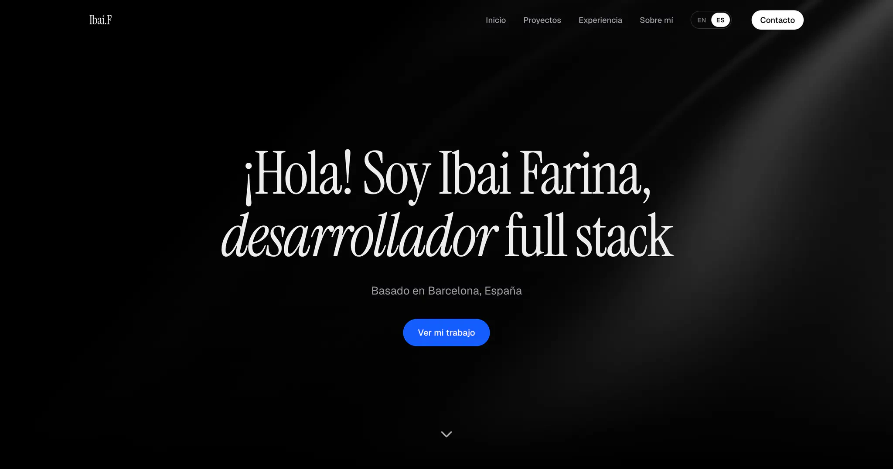
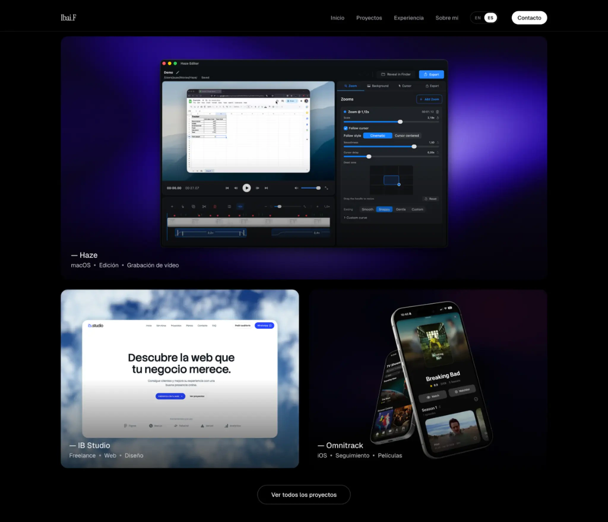
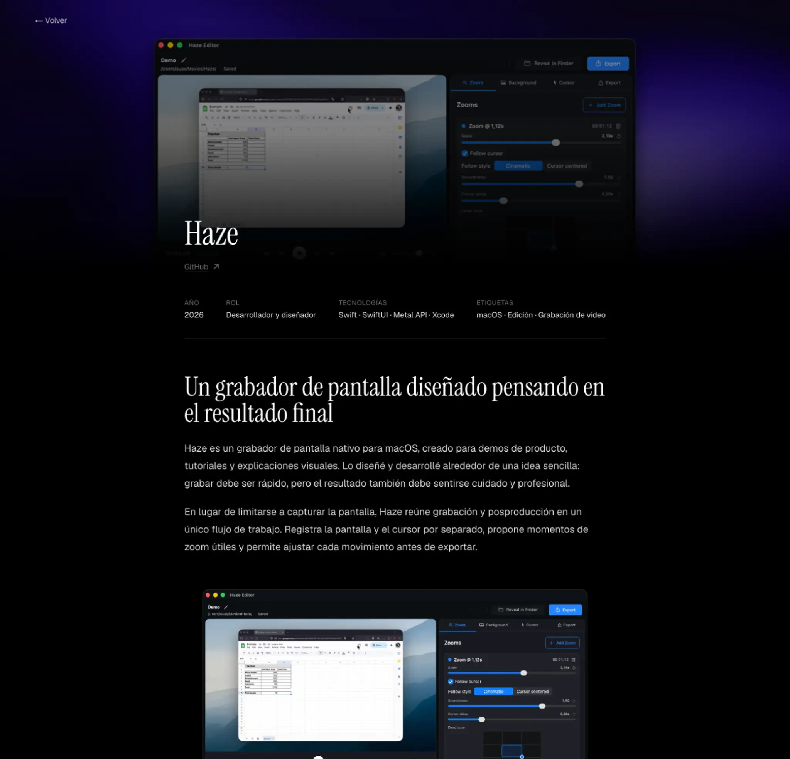
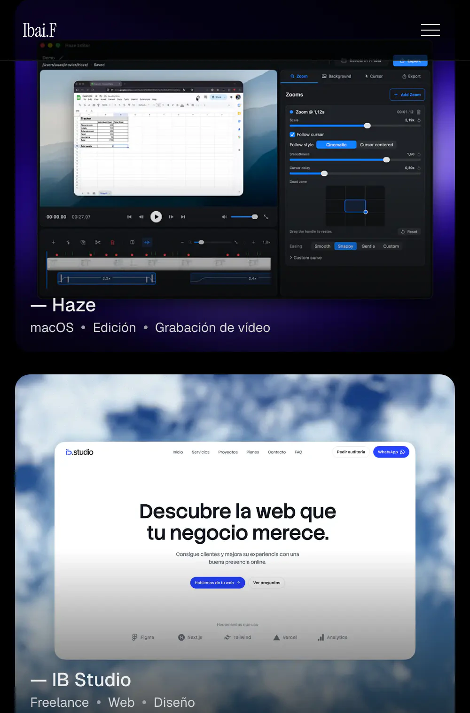
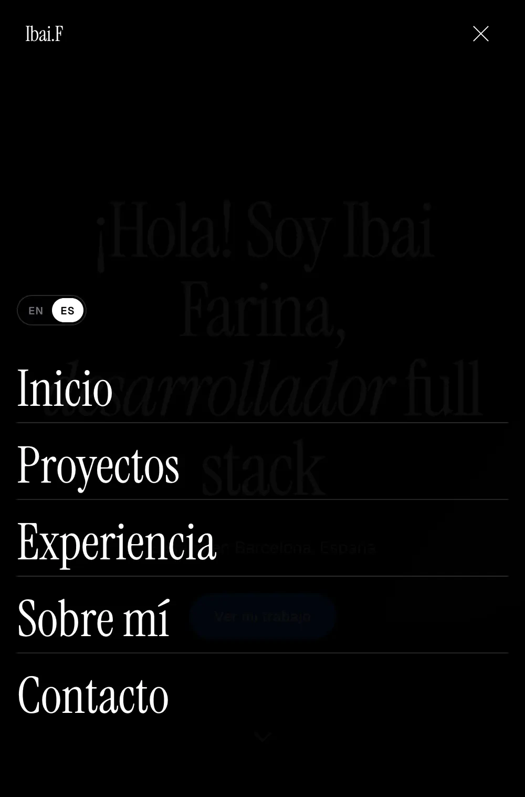

<div align="center">

# Ibai Farina's Portfolio

**My personal site, built to share my projects and the work behind them.**

[Visit ibaifarina.dev](https://ibaifarina.dev) · [Explore the projects](https://ibaifarina.dev/projects)

<br />



<br />

[](https://nextjs.org/)
[](https://react.dev/)
[](https://www.typescriptlang.org/)
[](https://tailwindcss.com/)
[](https://gsap.com/)

</div>

## About the project

[ibaifarina.dev](https://ibaifarina.dev) is my personal portfolio as a software developer and Data Science student. I built it from scratch to have one place where I can introduce myself, talk about the tools I use, and share the projects I work on.

I did not want it to be just a page of links. I wanted the site itself to show how I like to work, from the overall visual style to the smaller interactions and animations.

## Highlights

- **Project pages:** Each project has its own page with its goals, my role, the tools I used, images, and relevant links.
- **Markdown case studies:** I can add longer articles in English and Spanish without building each page by hand.
- **Animation:** GSAP and ScrollTrigger handle entrance animations, parallax, scroll effects, and content reveals.
- **Smooth scrolling:** Lenis runs across the site and stays in sync with the GSAP animation loop.
- **English and Spanish:** Both the interface and project content are translated. The site remembers the selected language while you browse.
- **Responsive layouts:** The navigation, layout, and animations have specific behavior for smaller screens.
- **Reduced motion:** The site checks the user's `prefers-reduced-motion` setting before running motion-heavy effects.

## Design and development

I planned the first version in Figma, then split the site into reusable React components for projects, experience, personal information, skills, and contact details. I kept the interface fairly minimal and spent most of the design time on typography, images, spacing, and transitions.

GSAP handles the entrance sequences and scroll-linked effects. Lenis keeps scrolling consistent on the home page, the project index, and each project page. These effects are disabled or simplified when the device has reduced motion enabled.



## Project and content system

Project details live in a shared data file, and Next.js generates the individual pages from dynamic routes. This keeps the cards and detail pages consistent and means I do not need to rebuild the layout whenever I add a project.

Projects can also have English and Spanish Markdown files under `content/projects/`. The site loads the matching article on the server and adds it to the project page. I use these articles when a screenshot and a list of technologies are not enough to explain the process behind a project.



## Tech stack

| Area | Technology |
| --- | --- |
| Framework | Next.js 16 with the App Router |
| UI | React 19 and TypeScript |
| Styling | Tailwind CSS 4 |
| Animation | GSAP, `@gsap/react`, and ScrollTrigger |
| Smooth scrolling | Lenis |
| Content | React Markdown, Remark GFM, and Rehype Raw |
| Typography | Geist and Instrument Serif through `next/font` |
| Analytics | Vercel Analytics |

## Getting started

### Requirements

- Node.js 20.9 or later
- pnpm

### Run locally

```bash
git clone https://github.com/ibaifarina/ibaifarina.dev.git
cd ibaifarina.dev
pnpm install
pnpm dev
```

Open [http://localhost:3000](http://localhost:3000) in your browser.

### Available commands

```bash
pnpm dev      # Start the development server
pnpm build    # Create a production build
pnpm start    # Run the production server
pnpm lint     # Run ESLint
```

## Project structure

```text
app/
├── layout.tsx                 # Root layout, metadata, fonts, and providers
├── page.tsx                   # Home page
└── projects/
    ├── page.tsx               # Project index
    └── [slug]/page.tsx        # Dynamic project detail pages

components/                    # Sections, cards, navigation, motion, and content UI
content/projects/              # Localized Markdown case studies
lib/
├── data.ts                    # Project and experience data
├── i18n.tsx                   # English/Spanish translations and locale state
└── project-articles.ts        # Server-side Markdown article loading

public/
├── cv/                        # Localized CV files
└── projects/                  # Project imagery and media
```

## Responsive experience

On smaller screens, the site changes the navigation, layout, and animation behavior instead of squeezing the desktop version into a narrower space.

<p align="center">
  
  
</p>

## Result

This is probably the project that represents me best. It combines frontend development, UI/UX, animation, and the small details I enjoy working on. Rather than only saying what I know, the site gives me a place to show it.
